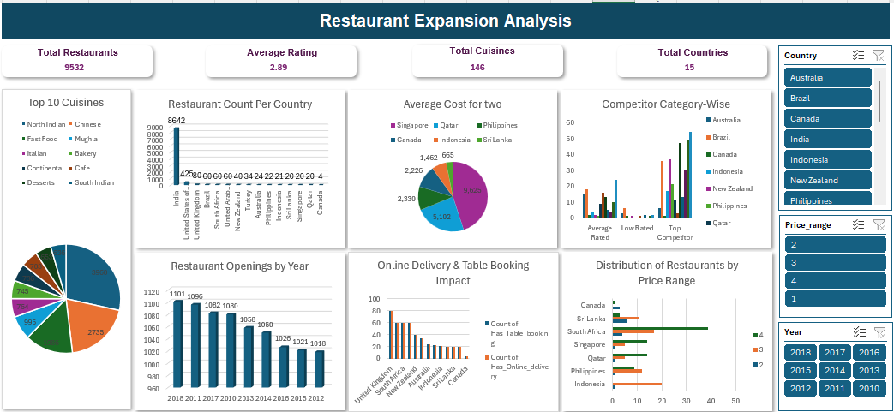

# 📊 Zomato Global Restaurant Market Analysis

**Author**: Sunny Bibyan  
**Project Title**: Zomato Global Restaurant Analysis & Expansion Strategy  

---

## 🧠 Project Overview

This project analyzes a comprehensive dataset of over 9,500 restaurants across 15 countries and 141 cities to support **Zomato’s expansion strategy**. The goal is to identify new market opportunities, analyze customer behavior, and provide actionable insights using data analysis and visualization techniques. The project also addresses missing values and enhances data integrity to ensure accuracy in conclusions.

---

## 🎯 Problem Statement

Zomato is seeking to understand **where to expand** its restaurant presence. The objective is to analyze user demographics, order behavior, cuisine preferences, pricing trends, and service availability to:

- Identify high-potential markets
- Improve customer experience
- Optimize resource allocation
- Expand strategically with data-backed decisions

---

## 📁 Dataset Overview

- **Total Restaurants**: 9,551  
- **Average Global Rating**: 2.89  
- **Average Cost for Two**: $10.06 (standardized to USD)  
- **Total Votes**: 1,498,645  
- **Countries**: 15  
- **Cities**: 141  
- **Cuisine Types**: Multiple traditional and modern options across regions  

---

## 🛠️ Methodology

### 1. **Data Cleaning**
- Removed duplicates
- Handled missing values in the Cuisines column

### 2. **Data Enrichment**
- Used `VLOOKUP` to map country codes to names
- Applied `COUNTIF`, logical formulas, and aggregation functions

### 3. **Descriptive Analysis**
- Pivot Tables for summary statistics
- Year-wise and country-wise exploration

### 4. **Visualization**
- Created dynamic Excel dashboards with slicers and charts to display:
  - Growth trends
  - Ratings vs. pricing
  - Cuisine popularity
  - Market penetration

---

## 📈 Key Insights

- **India** dominates the market with over 8652 restaurants.
- **Asia-Pacific** is the most saturated yet fastest-growing region.
- **Online Delivery + Table Booking** is highest in India, USA, and Brazil.
- **High Average Votes** from UAE, Indonesia, and Turkey—indicating strong demand.
- **North Indian and Chinese cuisines** are the most popular globally.
- **Cost doesn’t strongly affect rating**, but premium services often lead to higher customer satisfaction.

---

## ✅ Strategic Recommendations

- **Expand to underserved markets** like Indonesia, Sri Lanka, and Philippines.
- **Invest in premium experiences** in high-demand countries.
- **Localize menu offerings** to suit regional tastes.
- **Enhance digital services** like reservations and online ordering.
- **Adopt sustainable practices** to attract eco-conscious customers.
- **Target high-end diners** in countries with a higher average cost for two.

---

## 📊 Dashboard Highlights

- **Year-wise restaurant openings** show consistent growth (peak in 2018).
- **Correlation between ratings and average cost** observed in many regions.
- **Cuisine trend** maps popular food types by geography.
- Interactive features allow filtering by region, cuisine, year, and more.

---

## 📌 Tools Used

- Microsoft Excel (Pivot Tables, Charts, VLOOKUP, COUNTIF, Logical Formulas)
- Excel Dashboard for Data Visualization
- Data Cleaning and Enrichment Functions

---

## 🏁 Conclusion

This analysis provides a **data-driven framework** to support Zomato’s international expansion by leveraging customer preferences, location-based insights, and market trends. The final dashboard allows stakeholders to interact with the data and uncover trends in real time.

---

